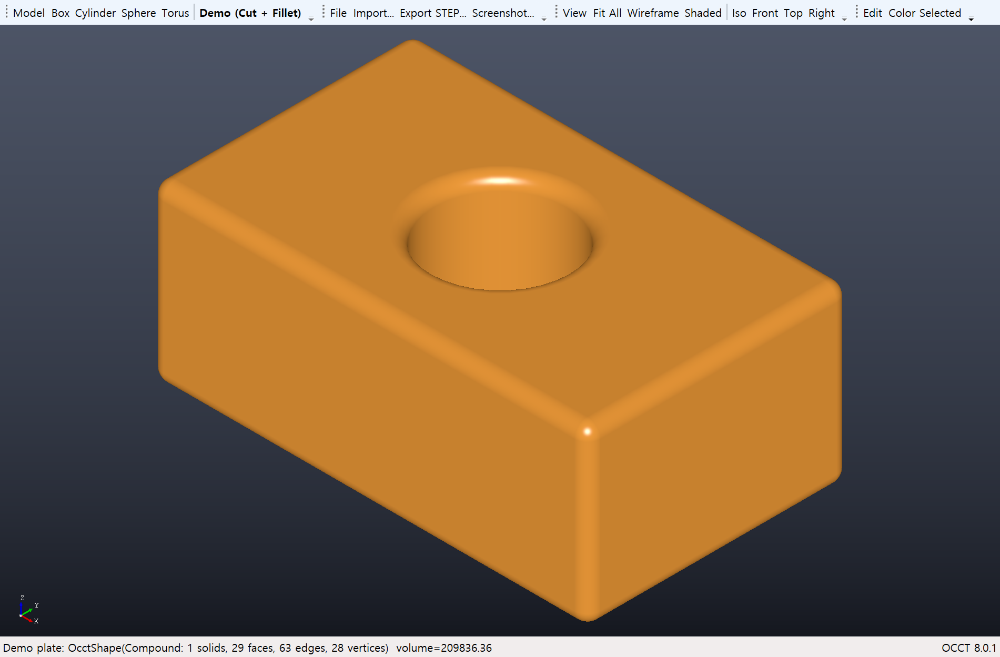

# OpenCascade-Lab

OCCT(Open CASCADE Technology) **V8.0.1** 을 C#에서 사용하기 위한 샘플 환경입니다.

- OCCT 자체는 C++ 라이브러리이므로 **C++/CLI 프록시(OcctProxy.dll)** 가 네이티브 OCCT와 .NET 사이를 연결합니다.
- 실제 모델링/뷰어 코드는 모두 **C# (.NET 8)** 으로 작성합니다.
- 참고 릴리스: <https://github.com/Open-Cascade-SAS/OCCT/releases/tag/V8.0.1>
- 참고 공식 샘플: <https://github.com/Open-Cascade-SAS/OCCT-samples-csharp> (WinForms/WPF + C++/CLI 프록시 방식, 이 저장소는 같은 구조를 .NET 8 / SDK 스타일로 재구성한 것)

```
C# 앱 (OcctLab.Cli / OcctLab.Viewer)
   │  .NET 참조
   ▼
OcctProxy.dll  (C++/CLI, /clr:netcore, net8.0)   ← src/OcctProxy
   │  네이티브 링크 (TKernel.lib, TKDESTEP.lib, TKOpenGl.lib ...)
   ▼
OCCT 8.0.1 DLL (TK*.dll) + 3rd-party DLL (freetype, tbb, jemalloc ...)   ← third_party/
```



## 1. 요구 사항

| 항목 | 내용 |
|---|---|
| OS | Windows 10/11 x64 |
| Visual Studio | 2022(v143) 또는 2026(v145). 워크로드 **"C++를 사용한 데스크톱 개발"** + 개별 구성 요소 **"C++/CLI 지원"** |
| .NET | .NET 8 SDK (또는 상위 SDK, `net8.0` 타깃) |
| OCCT | V8.0.1 Windows 바이너리 (`scripts/setup-occt.ps1` 이 자동 다운로드) |

> `dotnet build` 만으로는 C++/CLI 프로젝트를 빌드할 수 없습니다. 반드시 Visual Studio 또는 `scripts/build.ps1`(MSBuild.exe)을 사용하세요.

## 2. 빠른 시작

```powershell
# 1) OCCT V8.0.1 바이너리 다운로드 + 압축 해제 → third_party/occt, third_party/3rdparty
#    (-WithDebug: Debug 라이브러리(bind/libd) 포함 패키지, Debug|x64 빌드에 필요)
.\scripts\setup-occt.ps1 -WithDebug

# 2) 빌드 (Release|x64). Debug 는 -Configuration Debug
.\scripts\build.ps1

# 3) 콘솔 샘플 실행: 박스 - 원기둥 → 필렛 → 부피/면적 계산 → STEP/BREP/STL 내보내기 → STEP 재읽기 검증
.\src\OcctLab.Cli\bin\x64\Release\net8.0\OcctLab.Cli.exe

# 4) WPF 뷰어 샘플 실행 (OpenGL 3D 뷰, 마우스 회전/이동/줌, STEP/IGES/BREP 가져오기)
.\src\OcctLab.Viewer\bin\x64\Release\net8.0-windows\OcctLab.Viewer.exe
```

Visual Studio 에서는 `OpenCascade-Lab.sln` 을 열고 플랫폼을 **x64** 로 두고 `OcctLab.Cli` 또는 `OcctLab.Viewer` 를 시작 프로젝트로 지정해 F5 하면 됩니다.

## 3. 프로젝트 구성

```
OpenCascade-Lab/
├─ OpenCascade-Lab.sln
├─ Directory.Build.props        OCCT 경로(OcctRoot, OcctIncDir, OcctLibDir, OcctRuntimeDirs) 공통 정의
├─ scripts/
│  ├─ setup-occt.ps1            OCCT 릴리스 zip 다운로드/추출
│  └─ build.ps1                 vswhere 로 MSBuild 를 찾아 솔루션 빌드
├─ src/
│  ├─ OcctProxy/                C++/CLI 브리지 (OcctProxy.dll)
│  │  ├─ Common.h               문자열 변환, OcctException, OCCT_TRY/OCCT_CATCH 매크로, OcctInfo.Version
│  │  ├─ OcctShape.h            TopoDS_Shape 래퍼 (부피, 면적, 바운딩박스, 유효성 검사, 서브셰이프 수)
│  │  ├─ ShapeFactory.h         프리미티브(Box/Cylinder/Sphere/Cone/Torus), 불리언(Fuse/Cut/Common), 필렛/챔퍼, 변환
│  │  ├─ ShapeIO.h              STEP / IGES / BREP / STL 읽기·쓰기
│  │  └─ OcctViewer.h           V3d_Viewer + AIS_InteractiveContext 를 HWND 에 바인딩한 OpenGL 뷰어
│  ├─ OcctLab.Runtime/          OcctEnvironment: OCCT DLL 폴더를 PATH 에 등록 (앱 시작 시 1회 호출)
│  ├─ OcctLab.Cli/              콘솔 샘플 (헤드리스 모델링 → 파일 내보내기)
│  └─ OcctLab.Viewer/           WPF + WindowsFormsHost 뷰어 샘플
└─ third_party/                 (git 제외) occt/, 3rdparty/
```

### 3.1 C++/CLI 프록시가 하는 일

- `public ref class` 로 선언된 클래스만 C# 에 노출됩니다. 네이티브 OCCT 객체는 `TopoDS_Shape*`(OcctShape) 또는 `NCollection_Haft<Handle(...)>`(OcctViewer) 로 감싸서 보관합니다.
- OCCT 예외(`Standard_Failure`)는 `OCCT_CATCH` 매크로에서 .NET 예외 `OcctProxy.OcctException` 으로 변환됩니다.
- 파일 경로 등 문자열은 `ToAscii()` 로 UTF-16 → UTF-8 변환해 넘깁니다(한글 경로 가능).
- 링크할 OCCT 툴킷은 `OcctProxy.vcxproj` 의 `<AdditionalDependencies>` 에 있습니다. 새 기능(예: 오프셋 `TKOffset`, XCAF `TKXCAF`)을 쓰려면 여기에 lib 를 추가하세요.
- OCCT 8.0 참고: `Standard_True/False/Integer` 는 deprecated → `true/false/int` 사용. `TopTools_IndexedMapOfShape` → `NCollection_IndexedMap<TopoDS_Shape, TopTools_ShapeMapHasher>`. STEP/IGES/STL 툴킷 이름은 `TKDESTEP`, `TKDEIGES`, `TKDESTL`.
- `BRepFilletAPI_*` 처럼 over-aligned 멤버를 가진 객체를 지역 변수로 두는 함수는 `/clr` 에서 네이티브로 컴파일되므로, 그런 코드는 `Native::` 네임스페이스의 순수 네이티브 헬퍼로 분리했습니다(ShapeFactory.h 참고).

### 3.2 네이티브 DLL 로딩 방식

OCCT + 3rd-party DLL 은 1 GB 가까이 되므로 출력 폴더로 복사하지 않습니다. 대신 `OcctLab.Runtime` 이 빌드 시 `Directory.Build.props` 의 경로를 어셈블리 메타데이터로 구워 두고, 앱 시작 시 `OcctEnvironment.Initialize()` 가 그 폴더들을 `PATH` 앞에 추가합니다.

- **반드시 OcctProxy 타입을 처음 사용하기 전에 호출**해야 합니다 (CLI 는 `Program.Main`, 뷰어는 `App` 의 static 생성자).
- 다른 PC 로 배포할 때는 `OCCT_ROOT`(OCCT 루트) / `OCCT_RUNTIME_DIRS`(세미콜론 구분 DLL 폴더 목록) 환경 변수로 위치를 지정할 수 있습니다.
- Debug|x64 빌드는 `win64\vc14\bind` + `libd` 를 쓰므로 `-WithDebug` 패키지가 필요합니다.

## 4. C# 사용 예

```csharp
using OcctLab.Runtime;
using OcctProxy;

OcctEnvironment.Initialize();                 // 네이티브 DLL 경로 등록 (최초 1회)

using var box  = ShapeFactory.MakeBox(100, 60, 40);
using var hole = ShapeFactory.MakeCylinder(50, 30, -5, 0, 0, 1, radius: 15, height: 50);
using var plate = ShapeFactory.Cut(box, hole);
using var rounded = ShapeFactory.FilletAllEdges(plate, 3.0);

Console.WriteLine(rounded);                   // OcctShape(Solid: 1 solids, 31 faces, ...)
Console.WriteLine(rounded.Volume);
Console.WriteLine(rounded.GetBoundingBox());

ShapeIO.ExportStep(rounded, "plate.step");
using var again = ShapeIO.ImportStep("plate.step");
```

뷰어는 WinForms `Control` 의 `Handle` 을 `OcctViewer.Init(IntPtr)` 에 넘겨 만듭니다(`OcctViewControl.cs`). WPF 에서는 `WindowsFormsHost` 로 그 컨트롤을 호스팅합니다.

## 5. 문제 해결

| 증상 | 원인 / 조치 |
|---|---|
| `OcctNotFoundException` | `third_party/occt` 가 없음 → `scripts/setup-occt.ps1` 실행 또는 `OCCT_ROOT` 설정 |
| `BadImageFormatException` | 플랫폼이 x64 가 아님 → 솔루션 플랫폼 x64 확인 |
| `DllNotFoundException`/`FileNotFoundException` (OcctProxy) | `OcctEnvironment.Initialize()` 가 OcctProxy 타입 사용 이후에 호출됨, 또는 Debug 빌드인데 `bind` 폴더가 없음 |
| 빌드 시 MSB8020 / 툴셋 오류 | VS 의 C++ 툴셋/“C++/CLI 지원” 구성 요소 설치 |
| 뷰어 창이 검은색 | GPU/OpenGL 드라이버 확인 (원격 데스크톱 환경에서는 OpenGL 이 제한될 수 있음) |

## 6. 라이선스

OCCT 는 LGPL-2.1 + OCCT exception 입니다 (`third_party/occt/LICENSE_LGPL_21.txt`). 이 저장소의 샘플 코드는 자유롭게 사용하세요.
